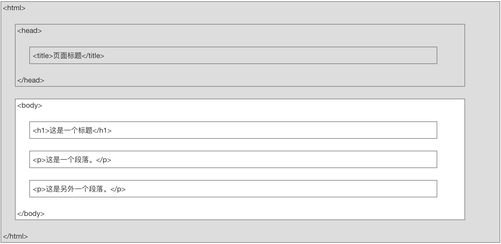

[TOC]

# 基础

## 格式



## 属性

- HTML 链接由 <a> 标签定义。链接的地址在 **href 属性**中指定：

- ```html
  <a href="http://www.runoob.com">这是一个链接</a>
  ```

- <a href="http://www.runoob.com">这是一个链接</a>

- HTML 属性常用引用属性值

  - 属性值应该始终被包括在引号内。
  - 双引号是最常用的，不过使用单引号也没有问题。

- | 属性  | 描述                                                         |
  | ----- | ------------------------------------------------------------ |
  | class | 为html元素定义一个或多个类名（classname）(类名从样式文件引入) |
  | id    | 定义元素的唯一id                                             |
  | style | 规定元素的行内样式（inline style）                           |
  | title | 描述了元素的额外信息 (作为工具条使用)                        |

### target 属性

使用 target 属性，你可以定义被链接的文档在何处显示。

下面的这行会在新窗口打开文档：

```html
<a href="https://www.runoob.com/" target="_blank" rel="noopener noreferrer">访问菜鸟教程!</a>
```

<a href="https://www.runoob.com/" target="_blank" rel="noopener noreferrer">访问菜鸟教程!</a>

## 标题

- 搜索引擎使用标题为您的网页的结构和内容编制索引。
- 因为用户可以通过标题来快速浏览您的网页，所以用标题来呈现文档结构是很重要的。
- 应该将 h1 用作主标题（最重要的），其后是 h2（次重要的），再其次是 h3，以此类推。

## 格式化标签

HTML 使用标签 \<b>("bold") 与 \<i>("italic") 对输出的文本进行格式, 如：**粗体** or *斜体*

| <b>      | 定义粗体文本 |
| -------- | ------------ |
| <em>     | 定义着重文字 |
| <i>      | 定义斜体字   |
| <small>  | 定义小号字   |
| <strong> | 定义加重语气 |
| <sub>    | 定义下标字   |
| <sup>    | 定义上标字   |
| <ins>    | 定义插入字   |
| <del>    | 定义删除字   |

## 图像

在 HTML 中，图像由\ 标签定义。

\ 是空标签，意思是说，它只包含属性，并且没有闭合标签。

## 源属性

要在页面上显示图像，你需要使用源属性（src）。src 指 "source"。源属性的值是图像的 URL 地址。

**定义图像的语法是：

```html

```

URL 指存储图像的位置。如果名为 "pulpit.jpg" 的图像位于 www.runoob.com 的 images 目录中，那么其 URL 为 http://www.runoob.com/images/pulpit.jpg。

浏览器将图像显示在文档中图像标签出现的地方。如果你将图像标签置于两个段落之间，那么浏览器会首先显示第一个段落，然后显示图片，最后显示第二段。


## Alt属性

alt 属性用来为图像定义一串预备的可替换的文本。

替换文本属性的值是用户定义的。

```html

```

在浏览器无法载入图像时，替换文本属性告诉读者她们失去的信息。此时，浏览器将显示这个替代性的文本而不是图像。为页面上的图像都加上替换文本属性是个好习惯，这样有助于更好的显示信息，并且对于那些使用纯文本浏览器的人来说是非常有用的。


## CSS

CSS 可以通过以下方式添加到HTML中:

- 内联样式- 在HTML元素中使用"style" **属性**

  - 当特殊的样式需要应用到个别元素时，就可以使用内联样式。 使用内联样式的方法是在相关的标签中使用样式属性。样式属性可以包含任何 CSS 属性。以下实例显示出如何改变段落的颜色和左外边距。

  - <p style="color:blue;margin-left:20px;">这是一个段落。</p>

  - ```html
    <p style="color:blue;margin-left:20px;">这是一个段落。</p>
    ```

- 内部样式表 -在HTML文档头部 \<head> 区域使用\<style> **元素** 来包含CSS

  - 当单个文件需要特别样式时，就可以使用内部样式表。你可以在\<head> 部分通过 \<style>标签定义内部样式表:

  ```html
    <head>
    <style type="text/css">
    body {background-color:yellow;}
    p {color:blue;}
    </style>
    </head>
  ```

- 外部引用 - 使用外部 CSS **文件**

  - 当样式需要被应用到很多页面的时候，外部样式表将是理想的选择。使用外部样式表，你就可以通过更改一个文件来改变整个站点的外观。

  - ```html
    <head>
    <link rel="stylesheet" type="text/css" href="mystyle.css">
    </head>
    ```

最好的方式是通过外部引用CSS文件.


## 表格

表格由 \<table> 标签来定义。每个表格均有若干行（由 \<tr> 标签定义），每行被分割为若干单元格（由 \<td> 标签定义）。字母 td 指表格数据（table data），即数据单元格的内容。数据单元格可以包含文本、图片、列表、段落、表单、水平线、表格等等。

### 定义边框: border

<p style="color:blue;margin-left:20px;">这是一个表格。</p>
<table border="2">	<!--边框为1 -->
    <tr>
        <td>row 1, cell 1</td>
        <td>row 1, cell 2</td>
    </tr>
    <tr>
        <td>row 2, cell 1</td>
        <td>row 2, cell 2</td>
    </tr>
</table>


### 表头<th> </th>

<table border="1">
    <tr>
        <th>Header 1</th>
        <th>Header 2</th>
    </tr>
    <tr>
        <td>row 1, cell 1</td>
        <td>row 1, cell 2</td>
    </tr>
    <tr>
        <td>row 2, cell 1</td>
        <td>row 2, cell 2</td>
    </tr>
</table>


## 列表

### 无序列表

无序列表是一个项目的列表，此列项目使用粗体圆点（典型的小黑圆圈）进行标记。 

无序列表使用 \<ul> 标签

<ul>
<li>Coffee</li>
<li>Milk</li>
</ul>

### 有序列表

同样，有序列表也是一列项目，列表项目使用数字进行标记。 有序列表始于 \<ol> 标签。每个列表项始于 \<li> 标签。

列表项使用数字来标记。

<ol>
<li>Coffee</li>
<li>Milk</li>
</ol>


### 自定义列表

自定义列表不仅仅是一列项目，而是项目及其注释的组合。

自定义列表以 \<dl> 标签开始。每个自定义列表项以 \<dt> 开始。每个自定义列表项的定义以 \<dd> 开始。

<dl>
<dt>Coffee</dt>
<dd>- black hot drink</dd>
<dt>Milk</dt>
<dd>- white cold drink</dd>
</dl>


## 区块

### 区块元素

大多数 HTML 元素被定义为**块级元素**或**内联元素**。

块级元素在浏览器显示时，通常会以新行来开始（和结束）。

实例: \<h1>, \<p>, \<ul>, \<table>

### 内联元素

内联元素在显示时通常不会以新行开始。

实例: \<b>, \<td>, \<a>, \

### \<div> 元素

HTML \<div> 元素是块级元素，它可用于组合其他 HTML 元素的容器。

<div> 元素没有特定的含义。除此之外，由于它属于块级元素，浏览器会在其前后显示折行。

如果与 CSS 一同使用，\<div> 元素可用于对大的内容块设置样式属性。

\<div> 元素的另一个常见的用途是文档布局。它取代了使用表格定义布局的老式方法。使用 \<table> 元素进行文档布局不是表格的正确用法。\<table> 元素的作用是显示表格化的数据。

------

#### \<span> 元素

HTML \<span> 元素是内联元素，可用作文本的容器

\<span> 元素也没有特定的含义。 

当与 CSS 一同使用时，\<span> 元素可用于为部分文本设置样式属性。

## 布局

<div id="container" style="width:500px">

<div id="header" style="background-color:#FFA500;">
<h1 style="margin-bottom:0;">主要的网页标题</h1></div>

<div id="menu" style="background-color:#FFD700;height:200px;width:100px;float:left;">
<b>菜单</b><br>
HTML<br>
CSS<br>
JavaScript</div>

<div id="content" style="background-color:#EEEEEE;height:200px;width:400px;float:left;">
内容在这里</div>

<div id="footer" style="background-color:#FFA500;clear:both;text-align:center;">
版权 © runoob.com</div>


```html
<html>
<head> 
<meta charset="utf-8"> 
<title>菜鸟教程(runoob.com)</title> 
</head>
<body>

<div id="container" style="width:500px">

<div id="header" style="background-color:#FFA500;">
<h1 style="margin-bottom:0;">主要的网页标题</h1></div>

<div id="menu" style="background-color:#FFD700;height:200px;width:100px;float:left;">
<b>菜单</b><br>
HTML<br>
CSS<br>
JavaScript</div>

<div id="content" style="background-color:#EEEEEE;height:200px;width:400px;float:left;">
内容在这里</div>

<div id="footer" style="background-color:#FFA500;clear:both;text-align:center;">
版权 © runoob.com</div>

</div>
 
</body>
</html>
```

```html
<!DOCTYPE html>
<html>
<head> 
<meta charset="utf-8"> 
<title>菜鸟教程(runoob.com)</title> 
</head>
<body>

<table width="500" border="0">
<tr>
<td colspan="2" style="background-color:#FFA500;">
<h1>主要的网页标题</h1>
</td>
</tr>

<tr>
<td style="background-color:#FFD700;width:100px;vertical-align:top;">
<b>菜单</b><br>
HTML<br>
CSS<br>
JavaScript
</td>
<td style="background-color:#eeeeee;height:200px;width:400px;vertical-align:top;">
内容在这里</td>
</tr>

<tr>
<td colspan="2" style="background-color:#FFA500;text-align:center;">
版权 © runoob.com</td>
</tr>
</table>

</body>
</html>
```

## 表单

表单是一个包含表单元素的区域。

表单元素是允许用户在表单中输入内容,比如：文本域(textarea)、下拉列表、单选框(radio-buttons)、复选框(checkboxes)等等。

表单使用表单标签 \<form> 来设置:

```html
<form>
.
*input 元素*
.
</form>
```

### 输入元素

多数情况下被用到的表单标签是输入标签（\<input>）。

输入类型是由类型属性（type）定义的。大多数经常被用到的输入类型如下：

#### 文本域（Text Fields）

文本域通过\<input type="text"> 标签来设定，当用户要在表单中键入字母、数字等内容时，就会用到文本域。

<form>
First name: <input type="text" name="firstname"><br>
Last name: <input type="text" name="lastname">
</form>

#### 密码字段

密码字段通过标签\<input type="password"> 来定义:

<form>
Password: <input type="password" name="pwd">
</form>

#### 单选按钮（Radio Buttons）

\<input type="radio"> 标签定义了表单单选框选项

<form>
<input type="radio" name="sex" value="male">Male<br>
<input type="radio" name="sex" value="female">Female
</form>

#### 复选框（Checkboxes）

\<input type="checkbox"> 定义了复选框. 用户需要从若干给定的选择中选取一个或若干选项。

<form>
<input type="checkbox" name="vehicle" value="Bike">I have a bike<br>
<input type="checkbox" name="vehicle" value="Car">I have a car 
</form>

#### 提交按钮（Submission

<form name="input" action="html_form_action.php" method="get">
Username: <input type="text" name="user">
<input type="submit" value="Submit">
</form>

#### 例子：发送邮件

<!DOCTYPE html>
<html>
<head> 
<meta charset="utf-8"> 
<title>菜鸟教程(runoob.com)</title> 
</head>
<body>

<h3>发送邮件到 someone@example.com:</h3>
<form action="MAILTO:someone@example.com" method="post" enctype="text/plain">
Name:<br>
<input type="text" name="name" value="your name"><br>
E-mail:<br>
<input type="text" name="mail" value="your email"><br>
Comment:<br>
<input type="text" name="comment" value="your comment" size="50"><br><br>
<input type="submit" value="发送">
<input type="reset" value="重置">
</form>


## 脚本

用javascipt。

<button type="button" onclick="myFunction()">点我！</button>

<button type="button" onclick="myFunction()">hey~</button>

# CSS

## 选择器

### id

id 选择器可以为标有特定 id 的 HTML 元素指定特定的样式。

HTML元素以id属性来设置id选择器,CSS 中 id 选择器以 "#" 来定义。

以下的样式规则应用于元素属性 id="para1":

```css
#para1
{
text-align:center;
color:red;
}
```

- ID属性不要以数字开头，数字开头的ID在 Mozilla/Firefox 浏览器中不起作用


### class

class 选择器用于描述一组元素的样式，class 选择器有别于id选择器，class可以在多个元素中使用。 

class 选择器在HTML中以class属性表示, 在 CSS 中，类选择器以一个点"."号显示：

在以下的例子中，所有拥有 center 类的 HTML 元素均为居中。

.center {text-align:center;}

你也可以指定特定的HTML元素使用class。

在以下实例中, 所有的 p 元素使用 class="center" 让该元素的文本居中:

p.center {text-align:center;}


